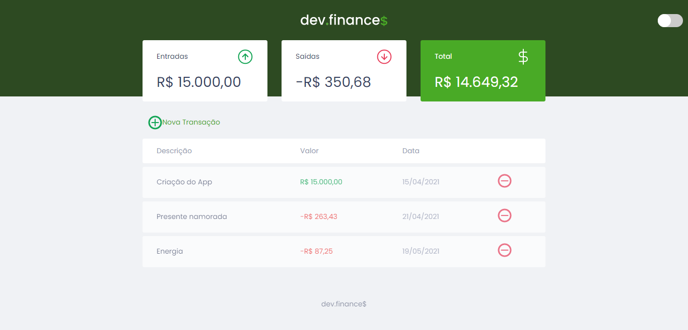
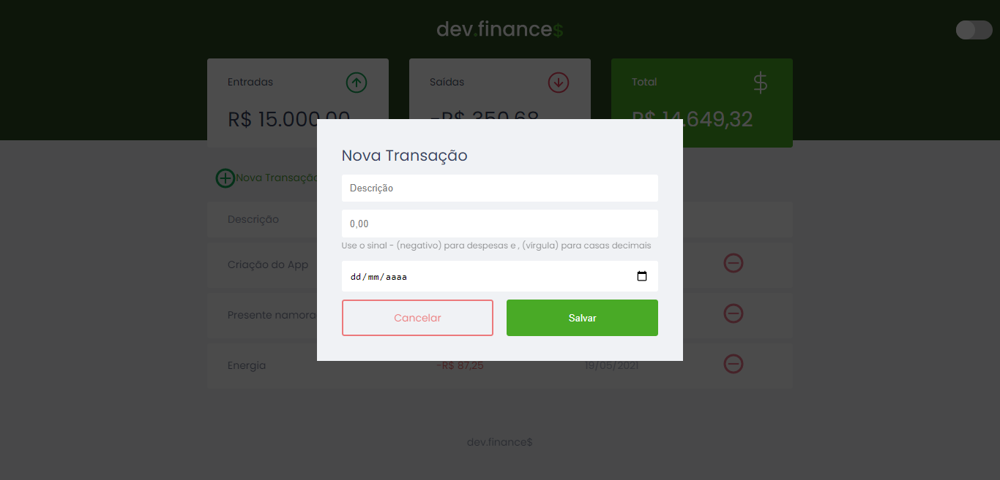

<hr>
  <h2>Sobre Projeto:</h2>
  <p>Dev.finance$ é uma aplicação monetária, com intuição de receber entradas e saídas.</p>
  
  <h3>Modal:</h3>
<hr>
  

<hr>
  <h2>Tecnologias usadas: 👨‍💻</h2>
<ul>
  <li>HTML 5</li>
  <li>CSS 3</li>
  <li>Javascript</li>
  <li>Localstorage</li>
</ul>

<h2>👷‍♂️ Instalação: </h2>
<p>Para rodar o projeto em sua máquina, você precisa do <a href="https://nodejs.org/en/">NodeJS</a> e do <a href="https://git-scm.com/">Git</a> instalado em sua máquina.
</p>

<p>Clonando o repositório em sua máquina:</p>
<p>Com SSH:</p>

  ```git clone git@github.com:Wiuver-Ribeiro/maratona-discover-dev.finance-.git```

<p>Com HTTPS:</p>

  ```git clone https://github.com/Wiuver-Ribeiro/maratona-discover-dev.finance-.git```

 <hr>  
 <h2>Criado por: <strong><a href="https://github.com/Wiuver-Ribeiro">Wiuver Ribeiro</a></strong>
 </h2>